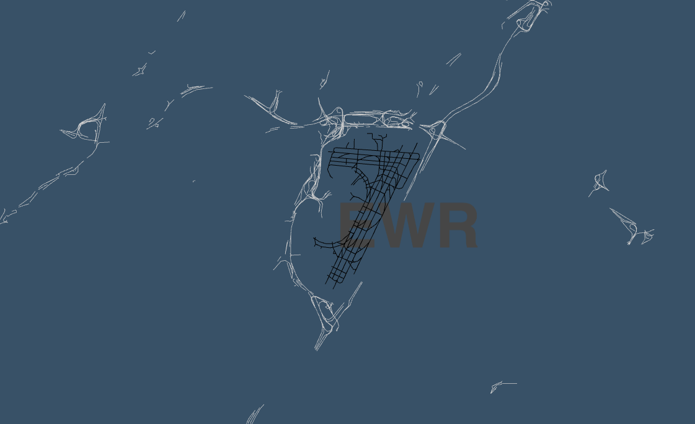
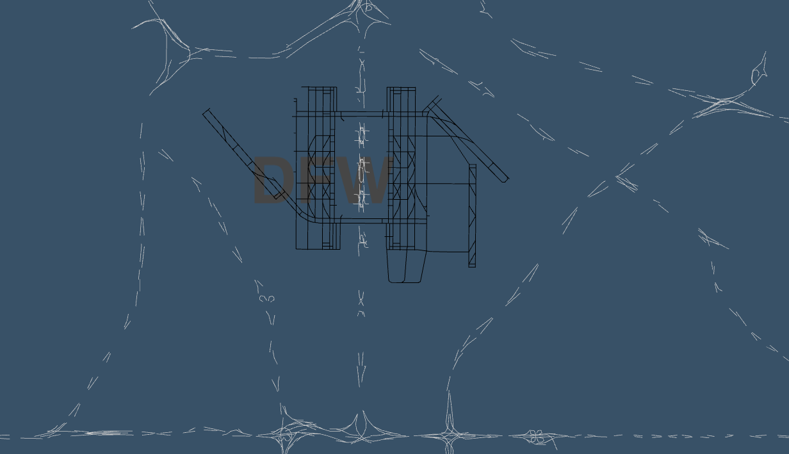
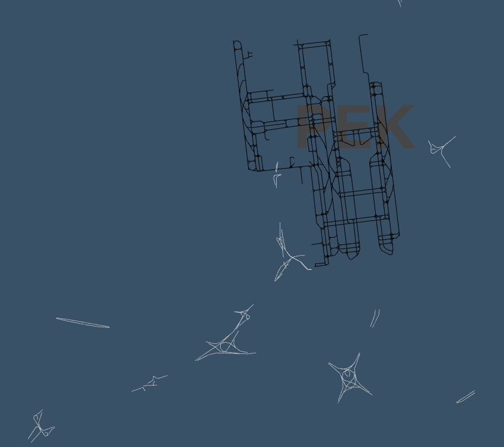

# tangram-airportcity

It's [Airport City](http://airportcity.spum.org/). In [Tangram](https://mapzen.com/projects/tangram/).








## Caveats

This is a work in progress. It is not finished yet. Also, in no particular order:

* The vector tiles don't have road/airport data < zoom 11
* There is no meaningful feedback when an airport search does not yield any results

## Usage

With all the above caveats in mind the easiest way to get started is to type the following:

```
./bin/start.py
```

This will start a local web server on port `2222` and an instance of the Airport City search API server on port `3333`. Then visit `localhost:2222` in your web browser.


## See also

* http://airportcity.spum.org/
* https://mapzen.com/projects/tangram/
* https://github.com/whosonfirst/go-airportcity-search
