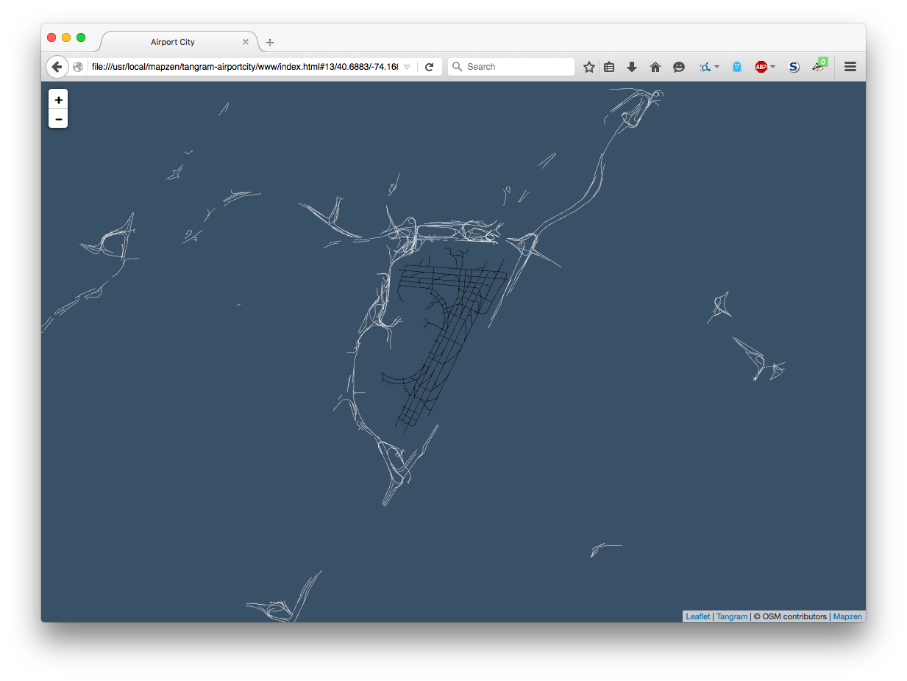
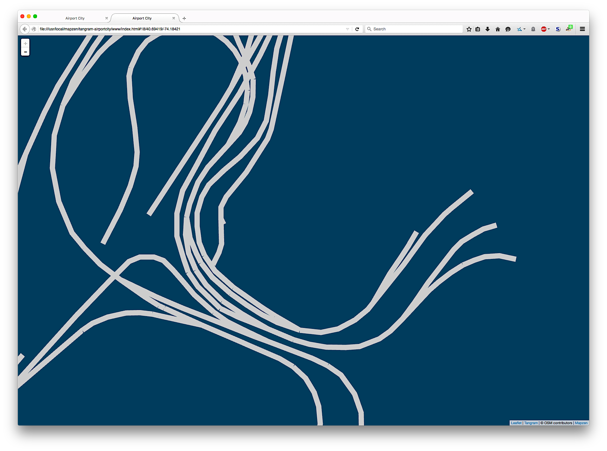

# tangram-airportcity

It's [Airport City](http://airportcity.spum.org/). In [Tangram](https://mapzen.com/projects/tangram/).

## Caveats

This is a work in progress. It is not finished yet. Also, in no particular order:

* There is a mix of local and remote Javascript and CSS
* Line widths are fixed (and not adjusted by zoom yet)
* The vector tiles don't have road/airport data < zoom 11
* Airport labels are not rendered or displayed
* There is no search yet

## See also

* http://airportcity.spum.org/
* https://mapzen.com/projects/tangram/
